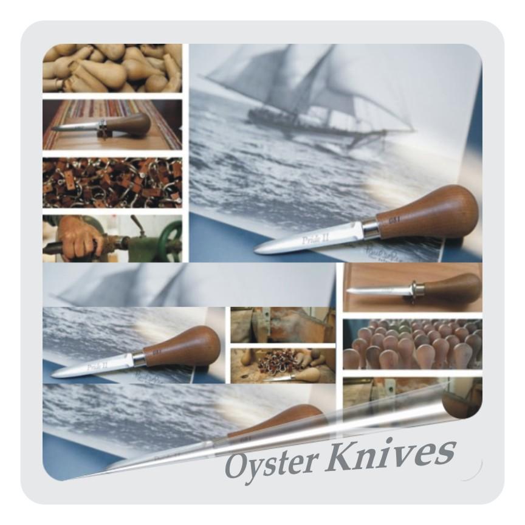

### Lessons In Design, Mostly For Fun
In addition to designing and building "digital things" for people who work with data, I learn and have just as much fun with the same process for "physical things" too. My story begins when I was a student interested in intellectual property law, with my plan for picking up some practical experience by taking a shot at getting a patent. What the heck, why not at least try? Although I couldn't think of anything useful, I wasn't about to let that stop me, so I just went ahead with a wacky musical marble contraption I'd been kicking around for a while. I was pleasantly surprised 15 months later to get [US Patent 5,569,867](https://www.google.com/patents/US5569867). Above is a simple 30 Marble Version I made in the 90s, and with many thanks and full approval to Wintergatan, Martin Molin's recent [2,000 Marble Version](https://www.youtube.com/watch?v=IvUU8joBb1Q) blows my mind as the best way to see it in action. There's also a musical educational toy version, I'll skip the details; quick summary: optioned by 3 toy companies, came close with Woodstock Percussion and even closer with GoKi, interesting prototypes were built, but none made it to production, bummer! My story has a happy ending, however, because I got to work with and get help from all kinds of talented designers, which led to other projects with other designers, and now I get to keep learning and having fun. Regardless of whether you're talented, or somewhat lacking like me and need help, I highly recommend teaming up with fun people and making non-digital things sometimes. I think it exercises other parts of my brain and makes me better at my digital day job. I like woodworking (aka sawdust therapy), welding and laser cutting with an [Epilog](https://www.epiloglaser.com/resources/sample-club.htm). Find what works for you and give it a try. Below are a few examples that work for me, done with help from talented people right here in Baltimore!

 

### Pride of Baltimore Oyster Knives
Working with Dale German, commissioned by The Pride of Baltimore and The Oyster Recovery Project to raise funds to support Chesapeake Bay restoration, we made [500 Commemorative Oyster Knives](https://oysterrecovery.org/pride-knife) crafted from [timber used to build The Pride of Baltimore II](http://www.pride2.org/blog/keepsake-oyster-knives-crafted-from-timber-used-to-build-pride-ii). The knife design is a classic symbol of Chesapeake Bay culture that's one of the earliest known types used to "split the rock." Dale taught me the old school way to get the knife in the handle - you heat it over a flame and just burn that sucker right it in there! I love that kind of stuff. Really fun project for a good cause.

 

### Tap Handles with The Brilliant Mark Supik & Co
[Mark Supik & Co](http://www.marksupikco.com/beertaps/custom/custom.html) is a Baltimore Treasure. Along with tap handles, they can help you with many other creative woodworking projects. Stop on by to check out what they do, see the Tap Handle Museum, sign up for a [Woodturning Class](http://www.marksupikco.com/School/school.class.beginningbowls.html) and finish off at [Monument City Brewing's](http://www.monumentcitybrewing.com) new location next door. It's a little slice of Heaven at [1 N Haven](https://www.google.com/maps/place/1+N+Haven+St,+Baltimore,+MD+21224/@39.29329,-76.5643966,18z/data=!4m5!3m4!1s0x89c804103a2e4723:0xfcd09b4b585852e1!8m2!3d39.2926631!4d-76.562401). I've worked on hundreds of tap handles with them. Each run is unique with interesting problems to solve. It's usually the easy sounding ones that have the hidden complicated parts. Very true for lots of projects, right?

 

### Pagoda for Baltimore City Fire Department
Working with Mark Supik, using the [Original 1890 Blueprints](http://highlandtowntraingarden.blogspot.com/2011/12/original-pagoda-plans-used-for-model.html), we built a scale model of the [Patterson Park Pagoda](https://commons.wikimedia.org/wiki/File:Patterson_Park_Observatory_Bmore.JPG#/media/File:Patterson_Park_Observatory_Bmore.JPG) for The Baltimore City Fire Department's [Highlandtown Train Garden](http://www.baltimoresun.com/news/opinion/columnists/bs-md-ci-kelly-column-garden-20151127-column.html). If you're in the area around Christmas, stop by Engine House 41 at 520 S Conkling Street. Sponsored by CSX and the Southeast Community Development Corporation, it's open to the public and free. Trying to create laser files for an exact scale model, off blueprints from the 1800s, my ability to get all "OCD" really came in handy! Another fun project for a good cause.

 

### I'm No Fashion Maven
All the more reason I like working with fashion designers. Plenty for me to learn here. Jewelry designers usually have serious graphic design software skills and have taught me a ton. I learned some great techniques I now use to enhance data visualizations. Earrings aren't exactly my thing, but I found myself getting way into making the displays from veneer. Who knew? [Raygun Robyn](http://raygunrobyn.bigcartel.com) does some really unique stuff by using laser cutting in her process, rather than her final product. She creates stencil files for fabric designs (shirt on the right). You never know what you're going to learn, even from projects that don't at first seem like they'll be your thing.

 

<iframe width="420" height="315" src="https://www.youtube.com/embed/WLKqLVUCKDU" frameborder="0" allowfullscreen></iframe>

### Arduino Powered Robotic Bell Paying Doorbell
How many times have you asked yourself, "Wouldn't it be great if I had a robotic bell playing doorbell I could program to play any song I want when somebody rings my doorbell?" Of course, who hasn't, everybody asks that at least 2 or 3 times a week. Well your prayers have finally been answered! Hook this up to computer to load song, unhook and put on shelf over door, then hook into doorbell and done. I'm sure you're now asking, "So simple, why didn't I think of that?" Too late, I got there first because I like making musical contraptions, both analog programming by marbles and digital programming by [Arduino](https://www.arduino.cc). Some have suggested this has more practical application for a clock chime. Sure, that makes sense, but then it wouldn't make less sense as a doorbell. You can probably tell I did this project on my own, without help, see what happens... now you really understand why I need help, in more ways than one! I can't figure out why people think the "physical things" I make should be useful? I make useful things for work and, left to my own devices, useless things Mostly For Fun. Makes sense to me at least. Sorry about the vertical video, by the way (wasn't planning to keep this one, never got to doorbell video).

 
 

#### That's it for now, head back [Home](http://www.jeffreylevine.com) 

 
 

